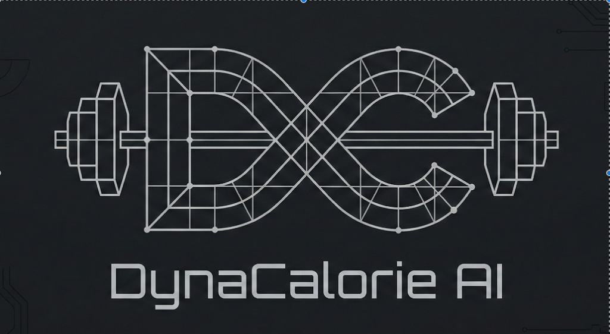
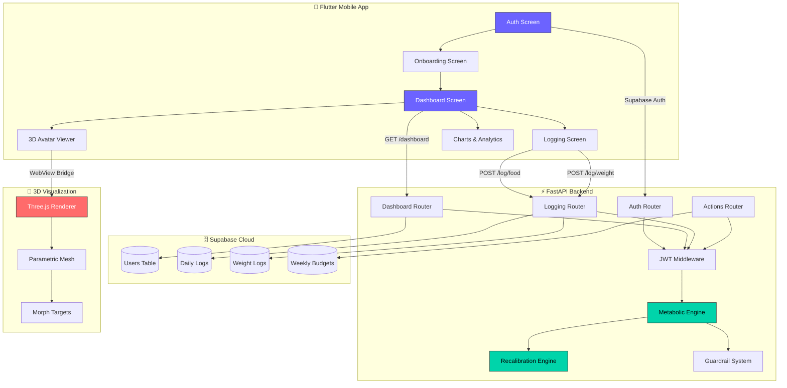
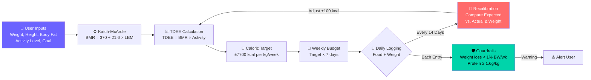
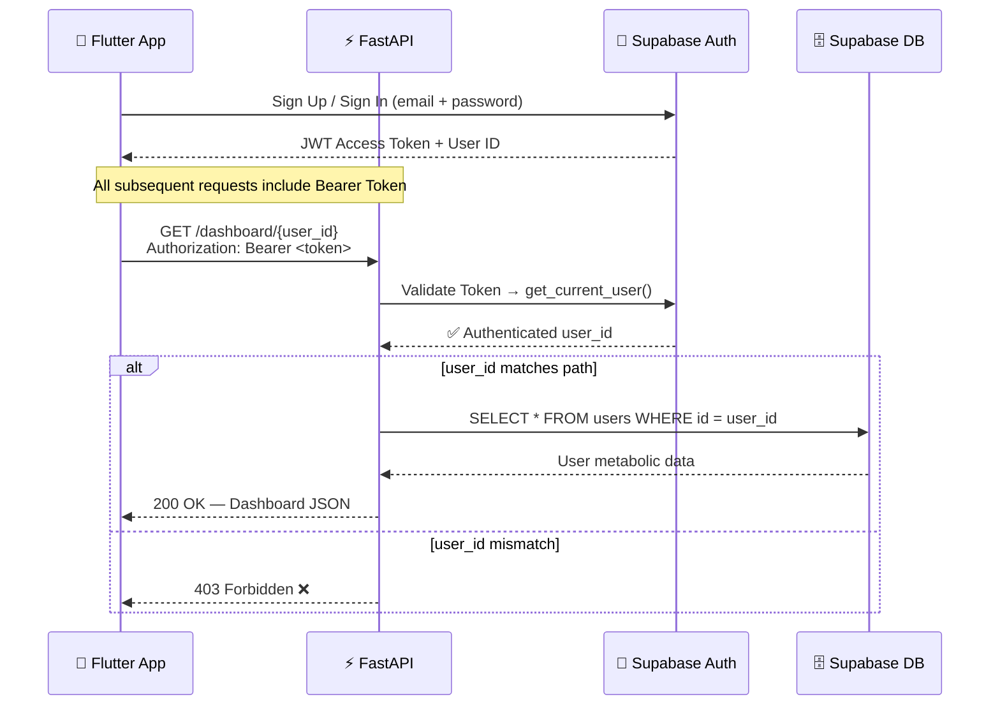

<div align="center">
  

  <br/><br/>

  **Your body is a thermodynamic system. DynaCalorie proves it mathematically.**

  [](https://flutter.dev/)
  [](https://fastapi.tiangolo.com/)
  [](https://supabase.com/)
  [](https://threejs.org/)
  [](https://python.org/)
  [](https://docs.pytest.org/)

  <br/>

  <i>An adaptive metabolic calorie tracking engine with a predictive 3D body visualization system.</i>

  ---

</div>

## 🧬 What is DynaCalorie AI?

Most calorie trackers give you a static daily number and call it a day. **DynaCalorie AI is fundamentally different.** It treats your metabolism as a dynamic system that changes over time and recalibrates itself every 14 days based on hard evidence — your actual weight change vs. predicted weight change.

It also lets you **see your future self** through a parametric 3D avatar that morphs in real-time based on your metabolic trajectory. Slide through 12 weeks of prediction and watch your body change before it actually happens.

<br/>

## 🏗️ System Architecture



<br/>

## 🔬 How the Metabolic Engine Works



<br/>

## ✨ Core Features

<table>
<tr>
<td width="50%">

### 🧠 14-Day Adaptive Recalibration
The engine compares your **predicted weight change** (from caloric deficit math) against your **actual weigh-in**. If you lost less than expected, your TDEE drops by 100 kcal. If you lost more, it increases. No more guessing — your metabolism is mathematically tracked.

</td>
<td width="50%">

### 🏋️ Muscle-Sparing Guardrails
Two hard-coded safety nets protect your lean tissue:
- **Rate Guard**: Warns if weekly weight loss exceeds `1%` of total bodyweight
- **Protein Guard**: Warns if daily protein intake falls below `1.6g per kg` of bodyweight

</td>
</tr>
<tr>
<td>

### 🧬 Predictive 3D Body Visualization
A **Three.js** parametric mesh renders your body shape and lets you scrub a slider from **Week 0 → Week 12** to see how your body will morph if you maintain your current eating pattern. Waist, chest, arms, and thighs all scale independently using tape measurement data.

</td>
<td>

### 📊 Weekly Budget System
Instead of a rigid daily calorie limit, DynaCalorie gives you a **weekly calorie budget**. Eat less on Monday? You have more room on Friday. The remaining budget dynamically redistributes across remaining days, enabling flexible dieting without guilt.

</td>
</tr>
<tr>
<td>

### 🔥 Refeed Mode
One-tap activation of a structured refeed day at `TDEE × 1.2`. The extra calories are **front-loaded** from the weekly budget — not added to it. The remaining days auto-tighten to compensate.

</td>
<td>

### 📈 Live Analytics Dashboard
Track your progress with `fl_chart` powered visualizations:
- 14-day weight trend line graph
- Daily calorie intake vs. target bar chart
- Protein compliance indicator
- Real-time remaining weekly budget

</td>
</tr>
</table>

<br/>

## 🔐 Security Architecture



<br/>

## 📂 Project Structure

```
Dyna_calorie/
├── backend/
│   ├── main.py                  # FastAPI entry + logging middleware
│   ├── auth_utils.py            # JWT Bearer token validation
│   ├── engine.py                # Metabolic calculation pipeline
│   ├── models.py                # Pydantic v2 request/response schemas
│   ├── config.py                # Environment variable validation
│   ├── database.py              # Supabase client initialization
│   ├── schema.sql               # PostgreSQL table definitions
│   ├── routers/
│   │   ├── auth.py              # Register / Login / Onboard
│   │   ├── dashboard.py         # Dashboard + Avatar + History
│   │   ├── logs.py              # Food & Weight logging
│   │   └── actions.py           # Refeed day activation
│   ├── static/3d_avatar/
│   │   ├── index.html           # Three.js viewport
│   │   └── app.js               # Parametric mesh + morph logic
│   └── tests/
│       └── test_dynacalorie.py  # Pytest metabolic math validation
│
├── flutter_app/
│   ├── lib/
│   │   ├── main.dart            # App root + Provider setup
│   │   ├── providers/
│   │   │   └── app_state.dart   # Global state (ChangeNotifier)
│   │   ├── screens/
│   │   │   ├── auth_screen.dart
│   │   │   ├── onboarding_screen.dart
│   │   │   ├── dashboard_screen.dart
│   │   │   ├── logging_screen.dart
│   │   │   └── avatar_screen.dart
│   │   └── services/
│   │       └── api_service.dart # REST API wrapper
│   ├── assets/icon/
│   │   └── app_icon.png         # Launcher icon
│   ├── pubspec.yaml
│   └── build_android.sh         # Play Store build script
│
├── dynacalorie.py               # Core metabolic formulas + simulation
└── DEBUG.md                     # Local demo troubleshooting guide
```

<br/>
 
## 🚀 Quick Start

### 1. Backend
```bash
# Create backend/.env with your Supabase credentials:
# SUPABASE_URL=https://your-project.supabase.co
# SUPABASE_KEY=your-anon-key
# SUPABASE_SERVICE_KEY=your-service-role-key

pip install -r backend/requirements.txt
python -m uvicorn backend.main:app --port 8000 --reload
```

### 2. Flutter App
```bash
cd flutter_app
flutter pub get
flutter run
```

### 3. Run Tests
```bash
PYTHONPATH=. pytest backend/tests/test_dynacalorie.py -v
```

### 4. Build for Play Store
```bash
cd flutter_app
./build_android.sh
# Output: build/app/outputs/bundle/release/app-release.aab
```

<br/>

## 🛠 Tech Stack Deep Dive

| Layer | Technology | Why This Choice |
| :--- | :--- | :--- |
| **Mobile UI** | Flutter + Provider | Single codebase for iOS & Android with reactive state management |
| **REST API** | FastAPI (async) | Sub-millisecond response times with automatic OpenAPI docs |
| **Database** | Supabase (PostgreSQL) | Row-Level Security + built-in Auth + realtime subscriptions |
| **3D Engine** | Three.js via WebView | Hardware-accelerated parametric body rendering on mobile |
| **Auth** | Supabase Auth + JWT | Industry-standard bcrypt hashing with zero custom crypto |
| **Charts** | fl_chart | Highly customizable native Flutter chart rendering |
| **Testing** | Pytest | Deterministic validation of metabolic math edge cases |

<br/>

---

<div align="center">

  **DynaCalorie AI** — *Where thermodynamics meets mobile engineering.*

  <br/>

  Made with 🔥 by [Vishva Teja](https://github.com/vishva2410)

</div>
